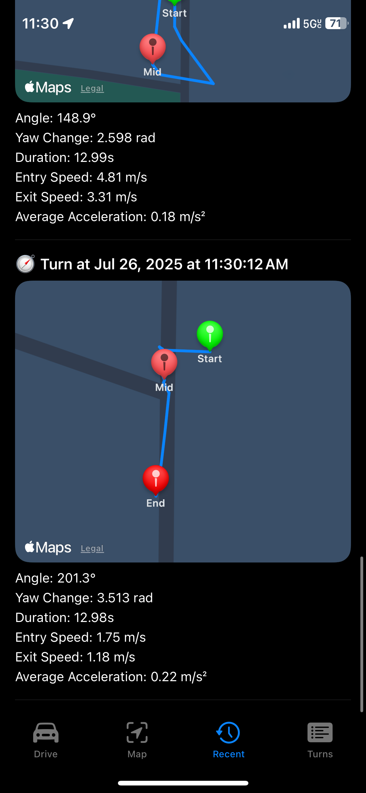
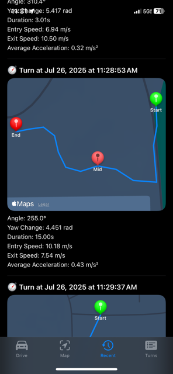

# Apexiel Telemetry & Turn Analysis (Swift / SwiftUI)

An iOS telemetry application built with **SwiftUI** that captures GPS and motion data during RallyCross sessions and visualizes driving performance, including automatic turn detection and lap comparison.

---

## 📱 Overview

This project began as an **automatic turn detection system** for RallyCross driving. It captures real-time telemetry data using Apple’s CoreLocation and CoreMotion frameworks, processes that data to detect turns based on confidence thresholds, and visualizes results in a modern SwiftUI interface.

The system has since evolved toward a broader goal: enabling drivers to visually compare laps, analyze performance sections, and eventually receive data-driven improvement insights.

---

## 🚗 Core Features

### 1. Telemetry Capture

* GPS position and heading
* Speed
* Accelerometer data
* Gyroscope data (X, Y, Z)
* Timestamped telemetry points

### 2. Automatic Turn Detection (Initial Feature)

Turns are detected when motion and location signals exceed a defined confidence threshold using:

* Heading change rate
* Gyro rotation values
* Acceleration changes
* Speed thresholds

This reduces false positives while capturing meaningful directional changes.

### 3. SwiftUI Visualization

* Real-time map rendering
* Color-coded lap overlays
* Highlighted detected turns
* Responsive dashboard interface

---

## 🛠 Tech Stack

* **Swift / SwiftUI**
* **CoreLocation**
* **CoreMotion**
* **MapKit**
* MVVM Architecture

---

## 📊 Dashboard / UI

## 🔄 Captured Turns Visualization

## 🎯 Project Goals

* Transform raw sensor data into meaningful driving insights
* Provide intuitive visual feedback for performance analysis
* Reduce confusion from false or over-detected turns
* Build a scalable foundation for future lap comparison and ML-based coaching

---

## 🚀 Future Direction

* Manual segment selection for precise analysis
* Lap-to-lap comparison with faster/slower highlighting
* Firebase-backed cloud storage
* ML-based performance insights

---

## 📌 Status

Actively developed as part of an internship focused on applied mobile systems design, telemetry processing, and performance visualization.

---
